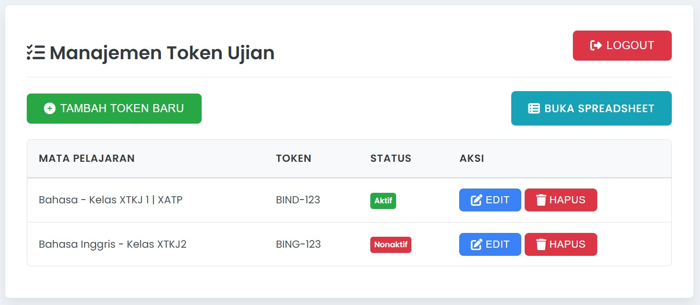

# Aplikasi Manajemen Token Ujian dengan Google Sheets

Aplikasi web responsif dan mobile-friendly untuk mengelola token ujian yang terintegrasi dengan Google Sheets sebagai backend. Aplikasi ini memungkinkan pengguna untuk login, melihat, menambah, mengedit, dan menghapus token mata pelajaran.

 

## ✨ Fitur

*   🔑 **Login Pengguna:** Otentikasi sederhana berbasis data di Google Sheet.
*   🎫 **Manajemen Token:**
    *   Menampilkan daftar token mata pelajaran beserta statusnya (Aktif/Nonaktif).
    *   Menambah token baru.
    *   Mengedit token yang sudah ada.
    *   Menghapus token.
*   📄 **Paginasi:** Menampilkan data token dalam beberapa halaman jika data banyak.
*   📊 **Integrasi Google Sheets:** Semua data pengguna dan token disimpan dan dikelola melalui Google Sheets.
*   📱 **Responsif & Mobile-Friendly:** Tampilan menyesuaikan dengan berbagai ukuran layar perangkat.
*   ✏️ **Penggantian Koma Otomatis:** Inputan koma (`,`) pada field Mata Pelajaran dan Token akan otomatis diganti dengan pipa (`|`) sebelum disimpan.
*   🔗 **Tombol Buka Spreadsheet:** Link langsung untuk membuka Google Sheet terkait.

## 🛠️ Teknologi yang Digunakan

*   **Frontend:** HTML, CSS, JavaScript (Vanilla JS)
*   **Backend:** Google Apps Script (terhubung ke Google Sheets)
*   **Styling:** CSS Kustom, [Font Awesome](https://fontawesome.com/) (untuk ikon), [Google Fonts (Poppins)](https://fonts.google.com/specimen/Poppins).

## 📋 Prasyarat

*   Akun Google.
*   Browser web modern (Chrome, Firefox, Safari, Edge).

## 🚀 Setup dan Konfigurasi

Proses setup melibatkan penyiapan Google Sheet, Google Apps Script, dan konfigurasi file HTML.

### Langkah 1: Setup Google Sheet

1.  Buat Google Sheet baru di [Google Drive](https://drive.google.com).
2.  Ubah nama spreadsheet sesuai keinginan Anda (misalnya, "Database Token Ujian").
3.  Penting: **Salin ID Spreadsheet Anda**. ID ini ada di URL spreadsheet (bagian antara `/d/` dan `/edit`).
    *   Contoh URL: `https://docs.google.com/spreadsheets/d/`**`INI_ADALAH_SPREADSHEET_ID_ANDA`**`/edit`
4.  Buat dua sheet (lembar kerja) di dalam spreadsheet tersebut dengan nama persis seperti berikut:
    *   **Sheet 1: `Users`**
        *   Kolom A: `Username`
        *   Kolom B: `Password`
        *   **Isi Data Contoh:**
            | Username | Password |
            | :------- | :------- |
            | `admin`  | `admin123` |
            | `user01` | `pass01`   |
        *   ⚠️ **Catatan Keamanan:** Menyimpan password dalam plain text sangat tidak direkomendasikan untuk aplikasi produksi. Pertimbangkan metode otentikasi yang lebih aman seperti Google Sign-In jika aplikasi akan digunakan secara luas atau menangani data sensitif.

    *   **Sheet 2: `Tokens`**
        *   Kolom A: `ID` (Akan diisi otomatis oleh script, biarkan kosong atau isi dengan ID unik jika sudah ada data)
        *   Kolom B: `MataPelajaran`
        *   Kolom C: `Token`
        *   Kolom D: `Status` (Isi dengan angka `1` untuk aktif, `0` untuk nonaktif)
        *   **Isi Data Contoh (Opsional):**
            | ID                        | MataPelajaran      | Token      | Status |
            | :------------------------ | :----------------- | :--------- | :----- |
            | `token_167xxxxxx_abc_xyz` | `Matematika XII`   | `XYZ123`   | `1`    |
            | `token_167xxxxxx_def_uvw` | `Bahasa Indonesia` | `ABC789`   | `0`    |

### Langkah 2: Setup Google Apps Script (`Code.gs`)

1.  Buka Google Sheet yang telah Anda buat pada Langkah 1.
2.  Klik menu **Extensions > Apps Script**. Sebuah tab baru akan terbuka dengan editor Apps Script.
3.  Hapus semua kode default yang ada di file `Code.gs`.
4.  **Salin seluruh isi file `Code.gs`** dari kode yang telah disediakan dan tempelkan ke editor Apps Script.
5.  **Konfigurasi Script (jika diperlukan):**
    *   Pastikan variabel `USER_SHEET_NAME` dan `TOKEN_SHEET_NAME` di bagian atas `Code.gs` sesuai dengan nama sheet yang Anda buat (`Users` dan `Tokens`).
    *   Jika script ini Anda buat sebagai **standalone script** (tidak terikat langsung dari sheet, melainkan dari [script.google.com](https://script.google.com)), Anda perlu mengupdate baris:
        ```javascript
        const SPREADSHEET_ID = SpreadsheetApp.getActiveSpreadsheet() ? SpreadsheetApp.getActiveSpreadsheet().getId() : null;
        ```
        menjadi:
        ```javascript
        const SPREADSHEET_ID = "ID_SPREADSHEET_ANDA_DARI_LANGKAH_1.3";
        ```
        Jika script dibuat dari menu "Extensions" di dalam sheet, baris aslinya sudah benar dan tidak perlu diubah.
6.  **Simpan Project Apps Script:** Klik ikon simpan (💾). Beri nama project (misalnya, "API Token Ujian").

### Langkah 3: Deploy Google Apps Script sebagai Web App

1.  Di editor Apps Script, klik tombol **"Deploy"** di kanan atas.
2.  Pilih **"New deployment"**.
3.  Klik ikon roda gigi (⚙️) di sebelah kiri "Select type", lalu pilih **"Web app"**.
4.  Isi kolom berikut dengan cermat:
    *   **Description:** (Opsional, misalnya "Manajemen Token Ujian v1.0")
    *   **Execute as:** Pilih **"Me (alamat email Anda)"**.
    *   **Who has access:** Pilih **"Anyone"**.
        *   🛑 **PENTING!** Pengaturan ini krusial agar frontend bisa mengakses API tanpa memerlukan login Google dari sisi pengguna akhir.
5.  Klik **"Deploy"**.
6.  Jika ini adalah deployment pertama atau ada perubahan yang memerlukan otorisasi baru, Google akan meminta izin:
    *   Klik **"Authorize access"**.
    *   Pilih akun Google Anda.
    *   Anda mungkin melihat peringatan "Google hasn't verified this app". Klik **"Advanced"** (Lanjutan).
    *   Klik **"Go to [Nama Project Anda] (unsafe)"** (Lanjutkan ke [Nama Project Anda] (tidak aman)).
    *   Tinjau izin yang diminta, lalu klik **"Allow"** (Izinkan).
7.  Setelah deployment berhasil, sebuah dialog akan muncul menampilkan **"Web app URL"**. **SALIN URL INI dengan lengkap dan benar.** Anda akan membutuhkannya untuk file `index.html`. Formatnya akan seperti: `https://script.google.com/macros/s/XXXXXXXXXXXXXX/exec`.

### Langkah 4: Setup File Frontend (`index.html`)

1.  **Salin seluruh isi file `index.html`** dari kode yang telah disediakan.
2.  Simpan sebagai file `index.html` di komputer Anda atau di server hosting Anda.
3.  **Buka file `index.html`** dengan editor teks.
4.  Cari baris berikut di dalam tag `<script>` (biasanya di bagian atas blok script):
    ```javascript
    const SCRIPT_URL = 'PASTE_YOUR_WEB_APP_URL_HERE_USING_doGet'; 
    ```
    Ganti `'PASTE_YOUR_WEB_APP_URL_HERE_USING_doGet'` dengan **URL Web App** yang Anda salin pada Langkah 3.7.
    Contoh setelah diganti:
    ```javascript
    const SCRIPT_URL = 'https://script.google.com/macros/s/AKfycbyB41WbqOB7ZioNC6hMW6jKswxuSpnLjFrhqajNY7JINEPvwcdk4ALX4IPgyBb_StHR0Q/exec';
    ```
5.  Cari juga baris:
    ```javascript
    const SPREADSHEET_LINK = "#"; 
    ```
    Ganti `"#"` dengan **link URL Google Sheet Anda yang sebenarnya** (yang Anda buat di Langkah 1). Ini untuk tombol "Buka Spreadsheet".
    Contoh setelah diganti:
    ```javascript
    const SPREADSHEET_LINK = "https://docs.google.com/spreadsheets/d/SPREADSHEET_ID_ANDA_YANG_DI_SALIN_DARI_LANGKAH_1.3/edit";
    ```
6.  Simpan perubahan pada file `index.html`.

## 📖 Cara Menggunakan Aplikasi

1.  Buka file `index.html` di browser web Anda. Anda bisa membukanya langsung dari file lokal (`file:///path/to/your/index.html`) atau jika Anda telah mengunggahnya ke server hosting, akses melalui URL hosting tersebut.
2.  **Halaman Login:**
    *   Masukkan `Username` dan `Password` yang sesuai dengan data yang ada di sheet `Users` pada Google Sheet Anda.
    *   Klik tombol "Login".
3.  **Halaman Utama (Manajemen Token):**
    *   Setelah login berhasil, Anda akan melihat tabel berisi daftar token ujian.
    *   **Tambah Token:** Klik tombol "Tambah Token Baru". Isi form yang muncul di modal, lalu klik "Simpan". Ingat, koma (`,`) akan otomatis diganti dengan pipa (`|`) pada inputan Mata Pelajaran dan Token.
    *   **Edit Token:** Klik tombol "Edit" pada baris token yang ingin diubah. Modifikasi data pada modal yang muncul, lalu klik "Simpan".
    *   **Hapus Token:** Klik tombol "Hapus" pada baris token yang ingin dihapus. Anda akan diminta untuk mengkonfirmasi penghapusan.
    *   **Paginasi:** Jika jumlah data token melebihi jumlah item per halaman (default 5), kontrol paginasi (tombol "Seb" dan "Ber", serta info halaman) akan muncul di bawah tabel.
    *   **Buka Spreadsheet:** Klik tombol "Buka Spreadsheet" untuk membuka Google Sheet yang menjadi database aplikasi ini di tab baru.
    *   **Logout:** Klik tombol "Logout" untuk kembali ke halaman login.

## 🔍 Troubleshooting

*   **Halaman Blank atau Tidak Bisa Login:**
    *   Pastikan `SCRIPT_URL` di `index.html` sudah benar dan merupakan URL dari deployment Web App yang **AKTIF** dengan akses **"Anyone"**.
    *   Buka Developer Console browser (biasanya tekan `F12`) dan periksa tab "Console" untuk pesan error JavaScript.
    *   Periksa tab "Network" di Developer Console untuk melihat status permintaan ke `SCRIPT_URL`. Pastikan tidak ada error CORS atau error jaringan lainnya (status 404, 500, dll.).
    *   Periksa menu "Executions" (Eksekusi) di editor Google Apps Script untuk melihat apakah ada error yang tercatat di sisi server.
*   **Error CORS (Cross-Origin Resource Sharing):**
    *   Penyebab paling umum adalah kesalahan konfigurasi deployment Apps Script. Pastikan **"Who has access"** diatur ke **"Anyone"**.
    *   Pastikan Anda menggunakan `doGet(e)` di `Code.gs` untuk semua operasi, sesuai dengan pola yang telah diimplementasikan.
*   **Melihat Halaman Error Google Drive "Halaman Tidak Ditemukan" saat mengakses URL `/exec`:**
    *   URL `SCRIPT_URL` yang Anda gunakan salah, tidak lengkap, atau deployment-nya tidak aktif/dihapus. **Buat deployment baru** dan gunakan URL baru yang dihasilkan.
*   **Data Tidak Muncul atau Operasi Gagal (Tambah/Edit/Hapus):**
    *   Periksa kembali nama sheet (`USER_SHEET_NAME`, `TOKEN_SHEET_NAME`) di `Code.gs`.
    *   Periksa nama kolom (header) di Google Sheet Anda. Script saat ini mengharapkan header seperti `ID`, `MataPelajaran`, `Token`, `Status` di sheet `Tokens` dan `Username`, `Password` di sheet `Users`. Konsistensi nama sangat penting.
    *   Lihat log di "Executions" Apps Script untuk detail error yang mungkin terjadi di backend.

## 🤝 Kontribusi

Merasa ada yang bisa ditingkatkan atau ingin menambahkan fitur baru? Silakan:
1.  Fork repositori ini.
2.  Buat branch fitur Anda (`git checkout -b fitur/FiturBaruAnda`).
3.  Commit perubahan Anda (`git commit -m 'Menambahkan FiturBaruAnda'`).
4.  Push ke branch (`git push origin fitur/FiturBaruAnda`).
5.  Buka Pull Request.

## 📜 Lisensi

Proyek ini dilisensikan di bawah [MIT License](LICENSE.md). (Anda bisa membuat file `LICENSE.md` terpisah jika mau, atau biarkan seperti ini jika tidak terlalu formal).